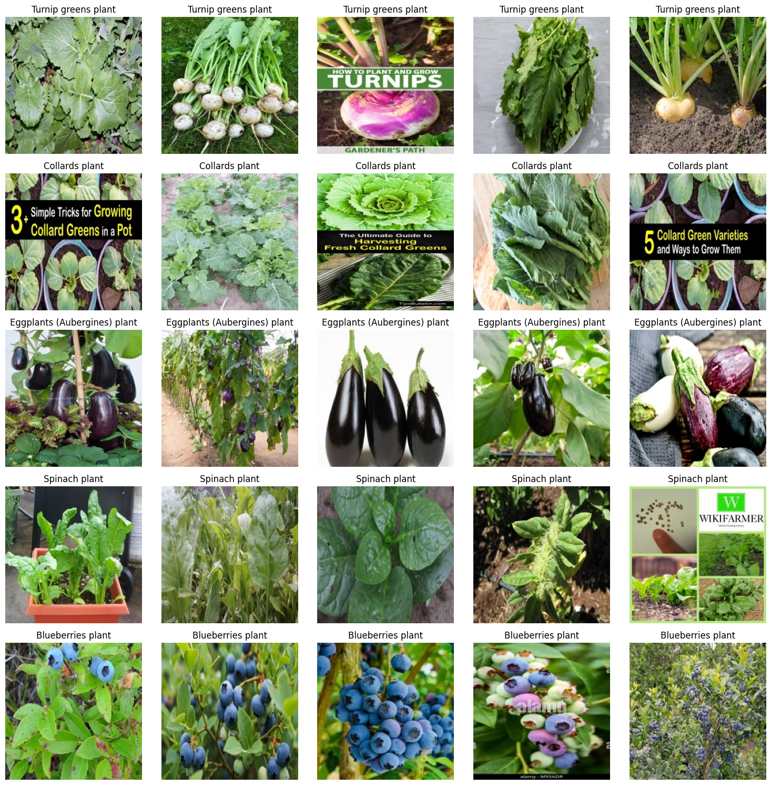

<div align="center">

<h1 align="center">Deep Learning Image Classification</h1>

<p align="center">
    <strong>A system for predicting Crop and classifier</strong>
</p>

[](./docs/README.pt-br.md)
[](./README.md)

</div>

## Table of Contents

- [Table of Contents](#table-of-contents)
- [About](#about)
- [Features](#features)
- [Technologies Used](#technologies-used)
- [Contributing](#contributing)
  - [Fork and clone the repository](#fork-and-clone-the-repository)
  - [Project Structure](#project-structure)
- [Build and Run with Docker Compose](#build-and-run-with-docker-compose)
  - [Prerequisites](#prerequisites)
  - [Building and Starting the Application](#building-and-starting-the-application)
- [Visualizations](#visualizations)
- [Usage Examples](#usage-examples)
- [See rendered notebook](#see-rendered-notebook)
- [License](#license)
- [Contact](#contact)

## About
This project is a **Deep Learning Crop Classifier** that uses a fine-tuned **ResNet-18** model to identify different types of crops from images. The application is built with **PyTorch** for the **machine learning** backend and **Streamlit** for the interactive web interface, making it easy for users to upload an image and get an instant prediction.

## Features

- **Image Classification:** Accurately classifies various crop types from user-uploaded images.
- **Deep Learning Model:** Utilizes a fine-tuned **ResNet-18** model for robust and efficient predictions.
- **ML Model Integration:** Loads a prediction model (`crop_classifier_model.pkl`) for data analysis.
- **Docker Compose Orchestration:** Simplifies setting up and running all services in an isolated environment.
- **Intuitive User Interface:** A simple, user-friendly web interface powered by Streamlit

## Technologies Used

This project utilizes a variety of technologies for both the deep learning model training and the deployment of the web application.

- ### **Model Training and Development:**

    - **PyTorch:** The primary deep learning framework for building, training, and evaluating the crop classification model.

    - **torchvision:** A library within the PyTorch ecosystem, used for handling image datasets and transformations.

    - **NumPy:** Essential for efficient numerical operations and data manipulation.

    - **Matplotlib:** Used for visualizing data, model training performance, and example predictions.

    - **Pillow (PIL):** A library for opening, manipulating, and saving many different image file formats.

    - **Joblib:** For saving and loading the trained model and its associated data, ensuring a fast and efficient way to deploy the model.

- ### **Web Application:**
    - **Streamlit:** The framework used to create the interactive and user-friendly web application for the crop classifier.

    - **PyTorch:** Used in the app to load the trained model and run predictions on user-uploaded images.

    - **torchvision:** Used for applying the necessary image transformations to user-uploaded images before they are passed to the model.

    - **Pillow (PIL):** To handle and process the image files uploaded by the user through the web interface.

    - **Joblib:** To load the model's parameters and other metadata from the saved file.

    - **io:** A standard Python module for handling in-memory file operations, specifically for reading the content of the uploaded image file.

- ### **Infrastructure:**
    - **Docker:** For containerization of services.
    - **Docker Compose:** For orchestration and management of multiple containers.

## Contributing
We welcome contributions! If you'd like to help improve this project, please follow the guidelines below.


### Fork and clone the repository

1. Fork the repository [(click here to fork now)](https://github.com/Caio-GBrayner/DeepLearning-Image-Classification)
2. Clone your fork: `git clone https://github.com/Caio-GBrayner/DeepLearning-Image-Classification`
3. Create a new branch for your changes: `git checkout -b feature/my-new-feature`
4. Push your commits: `git commit -m "Adds new feature"`
5. Push your changes to your fork: `git push origin feature/my-new-feature`
6. Submit a new Pull Request to the main repository.

### Project Structure
The project structure is organized as follows:
```
    Quality-air/
    ├── backend/                  # Contains the Flask API code and ML model
    │   ├── app.py                # Flask application
    │   ├── Air_Quality.pkl       # Machine Learning model
    │   ├── requirements.txt      # Backend dependencies
    │   └── Dockerfile            # Dockerfile for the backend service
    ├── frontend/                 # Contains static frontend files and Nginx configuration
    │   ├── index.html            # Main frontend page
    │   ├── style.css             # CSS styles
    │   ├── APP.js                # Frontend JavaScript logic
    │   ├── img/                  # Folder for static images
    │   │
    │   ├── nginx.conf            # Nginx configuration
    │   └── Dockerfile            # Dockerfile for the frontend service
    ├── docker-compose.yml        # Docker services orchestration
    └── README.md 
```
## Build and Run with Docker Compose

To get the system up and running, you'll need Docker and Docker Compose installed.

### Prerequisites

1. Make sure you have the following tools installed on your machine:

    - **Docker Engine:** [Installation instructions](https://docs.docker.com/engine/install/)
    - **Docker Compose:** Usually comes bundled with Docker Desktop. If not, [install it separately.](https://docs.docker.com/compose/install/)

### Building and Starting the Application
Follow these steps to build the images and start the services:

1. **Navigate to the project's root directory** in your terminal (where `docker-compose.yml is located`):

```bash
    cd /path/to/DeepLearning-Image-Classification/
```
2. **Build the images and start the containers:**

```bash
    docker compose up --build
```
- The `--build` command will ensure the images are built (or rebuilt if there are changes in the Dockerfiles).
- This process may take a few minutes the first time, as Docker will download base images and install dependencies.

3. **Access the application:**
Once the containers are running, you can access the Web Application in your browser at:

`http://localhost/8501`


4. **Stop the application:**
To stop and remove containers (but keep the built images), use:

```bash
    docker compose down 
```
To stop and remove containers, networks, and images (for a complete cleanup or rebuilding from scratch):

```bash
  docker compose down --volumes --rmi all  
```

## Visualizations



## Usage Examples
The backend exposes a main endpoint for prediction.


## See rendered notebook
1. Url: [Notebook Rendered](https://nbviewer.org./github/Caio-GBrayner/DeepLearning-Image-Classification/blob/main/EDA/model_tranining.ipynb)

## License

This project is licensed under the MIT License. See the [LICENSE](./LICENSE) file for more details.

### Contact

1. Connect with me, Caio Brayner - [LinkedIn](www.linkedin.com/in/caiogomesbrayner)
2. E-mail: caiogomesbrayner@outlook.com